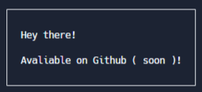

# DrawBoxing

A very small JS package made to draw boxes with text.

## Installing

In your project folder do:

```
git clone https://github.com/IsaacPar/dbox
npm install <path/to/folder> # the folder where this repository's index.js file is
```

## Usage

```js
import dbox from "drawboxing"

dbox.drawBox(
`
Hey there!

Avaliable on Github ( soon )!
`
)

```



## Known Issues

1. Emojis can move the borders to the left sometimes.
2. ANSI Codes inside main text will break.